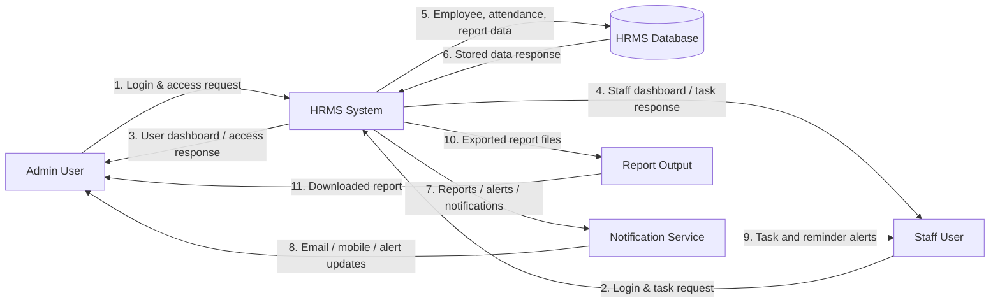
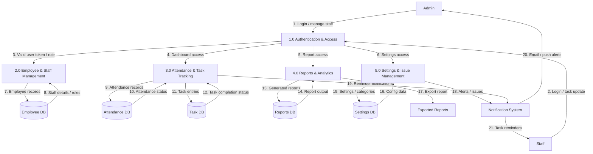
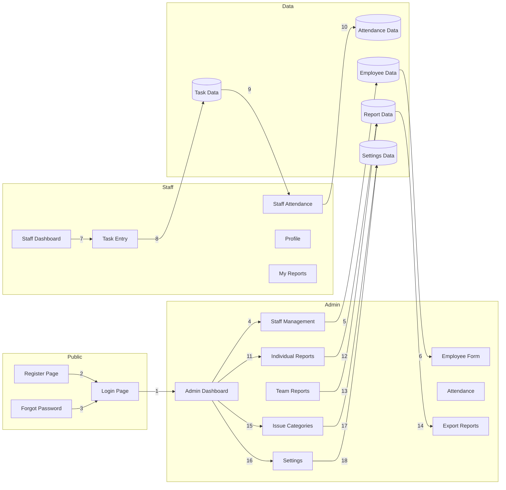

# HRMS Project Data Flow Diagram (DFD)

This DFD is designed for the current Angular HRMS project structure and explains the full flow of data between users, system modules, and data stores in a simple, numbered format.

> Note: This project is a frontend Angular application, so the diagram represents the app logic and the expected backend/data flow as a complete HRMS system design.

---

## 1. Level 0 DFD (Context Diagram)

### Level 0 Flow Explanation

1. Admin user sends login and access request to the HRMS system.
2. Staff user sends login and task request to the HRMS system.
3. System sends admin dashboard and authorization details.
4. System sends staff dashboard and task access details.
5. HRMS system stores and updates employee, attendance, and report data in the database.
6. Database returns saved data and records to the system.
7. System sends reports, alerts, and notifications to the notification service.
8. Notification service delivers alerts to admin users.
9. Notification service delivers reminders and updates to staff users.
10. System creates exported report files.
11. Admin downloads or reviews output reports.

---

## 2. Level 1 DFD (Main System Breakdown)

### Detailed Process Mapping to This Project

#### 1.0 Authentication & Access
- Login page
- Register page
- Forgot password page
- Role-based access for Admin and Staff

#### 2.0 Employee & Staff Management
- Staff management module
- Employee module
- Employee form
- Issue categories
- Settings

#### 3.0 Attendance & Task Tracking
- Admin attendance records
- Staff attendance page
- Task entry page
- Live feed activities

#### 4.0 Reports & Analytics
- Individual reports
- Team reports
- Export reports
- Dashboard summaries

#### 5.0 Settings & Issue Management
- Issue categories
- Admin settings
- System preferences
- Configuration management

---

## 3. Numbered Data Flow Mapping for the Full Project

### A. User Login Flow
1. User enters username/password on the login screen.
2. Login form sends data to Authentication module.
3. Authentication validates role: admin or staff.
4. System generates access token and redirect path.
5. User is redirected to dashboard or assigned page.

### B. Admin Management Flow
1. Admin opens Staff Management page.
2. Admin creates/updates employee records.
3. Employee data is validated by the form logic.
4. Data is stored in the Employee database.
5. Dashboard refreshes with updated staff list.

### C. Attendance Flow
1. Staff marks attendance or checks in.
2. Attendance data is sent to the attendance module.
3. System stores record in Attendance database.
4. Attendance is compared against working schedules.
5. Admin sees attendance summary on dashboard.

### D. Task Entry Flow
1. Staff submits daily tasks.
2. Task data goes to Task Entry module.
3. The task is stored in Task database.
4. Admin or manager views live feed and updates.
5. Completed tasks trigger notifications.

### E. Report Generation Flow
1. User selects report type (individual or team).
2. System fetches staff, task, and attendance data.
3. Data is processed in report engine.
4. Report summary is generated.
5. User exports or views the final report file.

### F. Settings and Issues Flow
1. Admin enters issue categories or configuration values.
2. System validates category/setting data.
3. Data is stored in Settings database.
4. UI reflects updated rules and labels.
5. Notifications are triggered for system-level updates.

---

## 4. Component-to-Data Flow Relationship in This Project

---

## 5. Simple Full-Project Summary

This HRMS project consists of 5 major data flows:

1. User authentication and access
2. Employee/staff management
3. Attendance and task tracking
4. Reports and exports
5. Settings, categories, and notifications

The main data movement is:

User -> System Modules -> Database -> Dashboard / Reports / Notifications -> User

---

## 6. Recommended Project Logic for Future Backend Integration

For a real backend version, connect each module to these tables:

- users
- employees
- departments
- attendance
- tasks
- reports
- issue_categories
- settings
- notifications

This will make the project scalable and easier to manage in a full-stack implementation.

---

## 7. Final DFD Interpretation

The full project works like this:

- Users log in to the system.
- Admins manage employees and operations.
- Staff record attendance and update tasks.
- Reports are generated from stored data.
- Configurations and issue records are updated in settings.
- All important actions trigger notifications and reporting outputs.

This gives a complete and clear data flow for the entire HRMS application.
